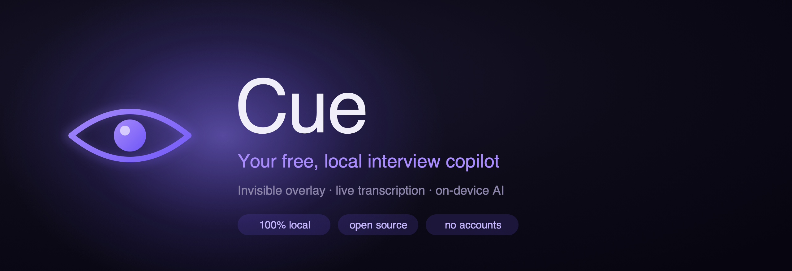

<p align="center">
  
</p>

# Cue

A **free, open-source, 100% local** macOS assistant for technical interviews — DSA, online assessments, competitive programming, **and** behavioral/resume questions. Invisible overlay, live meeting-audio transcription, screen reading, screenshots, and AI answers — all running on your own Mac.

No accounts. No subscriptions. Your choice of a fully-local model or your own cloud API key.

> **Honest note on "invisible":** Cue hides its overlay from *default* Zoom/Meet/Teams screen-share using `NSWindow.sharingType = .none` — the same public API Cluely uses. It does **not** hide from ScreenCaptureKit-based recorders (OBS, QuickTime) on macOS 15+, and no public macOS API can. See the [invisibility limits](#invisibility--honest-limits) below.

---

## Features

- **Ask anything** — type a question, get a streamed answer in the overlay.
- **Listen** 🎙 — capture meeting audio → live on-device transcription (whisper.cpp + Core ML) → answer on demand.
- **Read Screen** 👁 — OCR the screen (Apple Vision) and answer the visible question.
- **Screenshot** 📸 — drag-select a region → answered by a vision model.
- **File upload** 📎 — attach an image, PDF, or text file as context.
- **Reference Materials** — store your resume/project notes once; they're always available so the assistant can answer behavioral/resume/project questions, not just DSA.
- **Question auto-detect** — coding questions get code + complexity; behavioral/resume questions get natural, conversational answers.
- **Coding Modes** — General / Coding Interview / System Design / DSA personas.
- **Sessions + History** — a continuous scrollable log per session; past sessions are browsable.
- **Invisibility toggle** — hide the overlay from screen-share on demand.
- **Resizable overlay** — drag the bar to any size; it remembers it across launches.
- **Global hotkeys** — control it hands-free (see below).
- **Local or cloud** — run fully offline via Ollama, or bring your own OpenAI / Anthropic / Gemini key.

---

<!--
## Screenshots

Add your PNGs to assets/ with these names, then uncomment this section:

<table>
  <tr>
    <td width="50%"><br><sub><b>Ask anything</b> — the overlay bar streams an answer inline.</sub></td>
    <td width="50%"><br><sub><b>Listen</b> — live meeting-audio transcription in a session.</sub></td>
  </tr>
  <tr>
    <td width="50%"><br><sub><b>Onboarding</b> — first-run setup and permissions.</sub></td>
    <td width="50%"><br><sub><b>Settings</b> — provider, models, modes, and reference materials.</sub></td>
  </tr>
</table>

---
-->

## Requirements

- macOS 26.5+ (Apple Silicon recommended) — this is the project's deployment
  target; lower it in the Xcode build settings if you need to run on an older macOS
- **Xcode** to build
- For local inference: [Ollama](https://ollama.com)
- For cloud inference: an OpenAI, Anthropic, or Google Gemini API key

---

## Setup

### 1. Clone and open

```bash
git clone https://github.com/abbinavv/cluelyopen.git
cd cluelyopen
open cluelyopen/cluelyopen.xcodeproj
```

The Xcode project depends on the local `OpenCluelyCore` Swift package (the core logic module, already wired) and the `SwiftWhisper` package (resolved on first build — the first build compiles whisper.cpp and takes a couple of minutes).

### 2. Whisper models (for the Listen feature)

The whisper model files (`ggml-*.bin` and their Core ML `.mlmodelc` encoders) are **not** committed (they're large). Download the ones you want into `cluelyopen/cluelyopen/` so they bundle into the app:

```bash
cd cluelyopen/cluelyopen

# Fast, real-time default:
curl -L -o ggml-base.en.bin  https://huggingface.co/ggerganov/whisper.cpp/resolve/main/ggml-base.en.bin
curl -L -o coreml.zip https://huggingface.co/ggerganov/whisper.cpp/resolve/main/ggml-base.en-encoder.mlmodelc.zip && unzip -o coreml.zip && rm coreml.zip

# Optional, more accurate: small.en / medium.en (same URL pattern)
```

Core ML acceleration runs whisper on the Apple Neural Engine; the first Listen after launch does a one-time ANE compile.

### 3. Choose your model

**Option A — Local (private, free):** install Ollama and pull a coding model:

```bash
brew install ollama
ollama serve &                 # or run the Ollama app
ollama pull qwen2.5-coder:7b   # best coding model that fits a 16GB Mac
ollama pull llava              # optional: vision model for screenshots
```

**Option B — Cloud (BYOK, no download):** in the app, open **Settings → Provider**, pick OpenAI / Anthropic / Gemini, and paste your API key. Your key is sent directly to that provider — never through any Cue server.

### 4. Build & run

Press **▶ Run** in Xcode. The first launch shows an onboarding wizard for permissions.

---

## Project structure

```
OpenCluelyCore/          Swift package — pure logic, no UI, unit-tested (40 tests)
  Sources/               Settings, Modes, PromptBuilder, AnswerEngine, LLM clients
  Tests/                 swift test
cluelyopen/              Xcode app target — macOS/AppKit/SwiftUI shell
  cluelyopen/            Overlay bar, splash, onboarding, settings, capture, hotkeys
assets/                  README artwork
```

The app is a menu-bar agent with no dock icon or main window — `AppCore.swift` sets
`NSApp.setActivationPolicy(.accessory)` at launch, and the UI is a floating
`NSPanel` overlay.

> **A note on names:** the app is **Cue**, but the Xcode target, bundle ID
> (`abhinav.cluelyopen`), and core package (`OpenCluelyCore`) still use the
> original project name. These are internal identifiers users never see;
> renaming them would break signing and imports for no benefit.

Run the core test suite with:

```bash
cd OpenCluelyCore && swift test
```

---

## Permissions

macOS gates the core features behind two permissions (the onboarding wizard walks you through them; you can also review them in **Settings → Permissions**):

- **Screen Recording** — required for meeting-audio capture, screen OCR, and screenshots.
- **Accessibility** — required for global keyboard shortcuts.

The app is **not sandboxed** (macOS forbids sandboxed apps from capturing other apps' audio/screen) and is distributed by direct build/download — not the Mac App Store. This is standard for tools of this kind.

---

## Hotkeys

| Shortcut | Action |
|---|---|
| ⌘\ | Toggle overlay |
| ⌘↩ | Answer from current context |
| ⌘ + arrows | Move the overlay |
| double-tap ⌘ | Toggle overlay (quick gesture) |

---

## Invisibility — honest limits

`NSWindow.sharingType = .none` hides the overlay from **default** Zoom/Meet/Teams screen-share (the common case). It does **not** hide it from ScreenCaptureKit-based recorders (OBS, QuickTime) on macOS 15+ — there is no public macOS API that defeats those, and Cluely has the identical limitation. It also does not hide the window from your own local screenshots on your own Mac (that's expected macOS behavior). Use the invisibility toggle before sharing your screen, and test against your specific setup.

---

## Privacy

- **Local mode:** everything runs on your Mac. Transcription (whisper.cpp) and OCR (Apple Vision) are on-device; the only network call is to Ollama on `127.0.0.1`.
- **Cloud mode:** your prompts and API key go directly to the provider you chose. No Cue server is involved in any mode.
- Your resume/materials and API keys live in local app storage, not in this repository.

---

## License

Open source. Use responsibly and in accordance with the rules of any assessment or interview you participate in.
